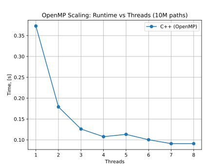
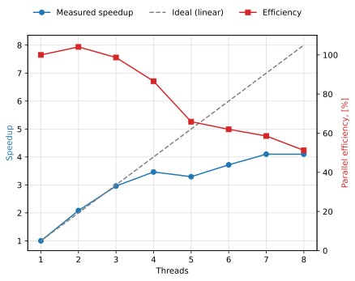

# Benchmarking Python vs. C++ Monte Carlo Option Pricing

This project benchmarks a pure Python Monte Carlo option pricer against a C++ implementation exposed as a Python module using pybind11. The objective is to measure differences in runtime performance while producing statistically consistent European call and put option prices.

### Benchmark Metrics

The following quantities were measured:

- Runtime over repeated executions with a fixed number of paths

- Runtime as a function of the number of simulated paths

-Speedup, defined as:

$\text{Speedup} = \frac{\text{Python runtime}}{\text{C++ runtime}}$

### Running Benchmarks

All benchmarks can be executed using:

`./run_benchmarks.sh`

This script runs:

- `comparing_impls_per_iter.py`

- `comparing_impls_per_num_sims.py`

Each script produces:

- A `.dat` file containing raw data

- `.svg` plots visualizing performance results

- Summary statistics, including average runtime and speedup values

Both implementations use deterministic random seeds per call to ensure that results are reproducible.

### System Specifications

Benchmarks were executed on the following system:

- CPU: Intel Core i7-8565U (8 threads @ 4.60 GHz)

- RAM: 16 GiB

### Results Summary
| Benchmark Type                 | Mean Speedup |
|------------------------------|-------------:|
| Repeated executions (fixed N) |        3.31× |
| Scaling by number of paths    |        3.20× |

| Implementation Type |  Mean repeated execution runtime | Scaling by number of paths |
|---------------------|---------------------------------:|---------------------------:|
| Python              |                           0.68 s |                    11.18 s |
| C++                 |                           0.21 s |                     3.54 s |

### OpenMP Parallel Scaling

The C++ engine is parallelized with OpenMP: each thread draws from its own
`std::mt19937` stream (seeded by base seed + thread id) and the call/put
payoffs are combined with a `reduction`. This is thread-safe and reproducible
for a fixed thread count. The benchmark below (`parallel_scaling.py`, 10M paths)
reports the best of 7 runs per thread count with a cooldown between
configurations to limit thermal throttling on the laptop CPU.

| Threads | Time [s] | Speedup | Efficiency |
|:-------:|---------:|--------:|-----------:|
| 1       |    0.373 |   1.00× |       100% |
| 2       |    0.179 |   2.08× |       104% |
| 3       |    0.126 |   2.96× |        99% |
| 4       |    0.108 |   3.46× |        87% |
| 8       |    0.091 |   4.10× |        51% |

Speedup is near-linear up to the 4 physical cores (3.46× at 4 threads), with
hyper-threading pushing the peak to ~4.1× across 8 logical threads.





### Interpretation

- The C++ backend consistently outperforms the pure Python implementation by approximately 3×.

- Both implementations produce similar prices for European call and put options.

- Differences decrease as the number of paths increases, consistent with Monte Carlo variance reduction.

### Sample Output

Example output for a fixed seed and one million simulated paths (in the scaling benchmark:

```terminal 
Num paths: 1000000 
Python: call price=10.4647, put price=5.5613, time=0.70s
C++: call price=10.4455, put price=5.5740, time=0.23s
Speedup ≈ 3.1x
% difference for call price=0.18
% difference for put price=0.23
```

Repeating the same function calls using the same seed produces identical prices for each implementation, confirming deterministic random number generation.

### Implementation Notes

- Python uses random.Random().gauss(...) to generate Gaussian random variables.

- C++ uses std::mt19937 and std::normal_distribution<double>.

- Random number generators are reset at the start of each pricing call to guarantee reproducible behavior.

- Python bindings are provided using pybind11, including static type stubs (.pyi files) for editor support.

- C++ code implements const correctness, exception-safe construction, and efficient memory handling.

### Conclusion

This benchmark demonstrates a clear performance advantage for C++ when executing large-scale Monte Carlo simulations while retaining the usability of a Python interface for scripting and analysis. The project provides a reproducible performance comparison and illustrates best practices in implementing numerical methods in both languages.